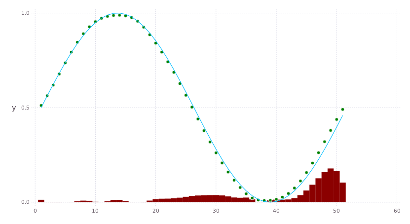

# Jannet ANN's playground

 Basic (yet artificial, not ready for natural one) neural network implementation in Julia language. Written for studying purposes.

## Usage

In order to use module directly from sources root, include path to Jannet module/src folder into LOAD_PATH list, e.g.:
```
julia> push!(LOAD_PATH, "./src" );
```
```
julia> using Jannet
julia> # in nn would be your brand new network
julia> nn = FFBPNet{Float32}( [3 10 2], learningRate=pi, momentum=0.2 );

```
First argument is a layout of network in form of 
> `[ <input size> <layer 1 size>... <layer K size> <output size> ]`,
where size corresponds to a number of nodes on the layer, layout organized from left to right, 
from input layer to the output. Type parameter of template could be any Real type.

### Train one sample
```
julia> x = Float32[ 1, 0.5, 0.1, 0 ]
julia> y = Float32[ 0, 1 ]
julia> learnOnePattern!( nn, x, y )
```
First vector is input with first bias activation element (should be equal to one), second is a desired output pattern vector

### Get the response
```
julia> p = sampleOnce(nn, x)
2-element Array{Float32,1}:
 0.15596 
 0.842187

```
In p would be the result for x pattern.  Jannet.sampleOnce! version exist.

## Tests

### Function approximation

_Note: path to Jannet module shoud be in LOAD_PATH list_

Sample training for function  approximation:

```
julia> include("tests/tests.jl")
...
julia> @time nn = Tests.t3(Float64, iters=1000000, lr=5, layout=[1 5 7 1], m = 0.05, epsilon=1e-5);
...
iter(604) 0.022774 sec   tr_err 0.00001930
iter(605) 0.022790 sec   tr_err 0.00000953
break out earlier on 605 iteration
train_error = 9.52945782156486e-6
testError = 9.971634658467265e-6
 14.698823 seconds (52.59 M allocations: 2.060 GB, 4.00% gc time)
```
`iters` - count of iterations, can break out of the loop earlier on `tr_err <= epsilon`, where `tr_err` 
is average squared error for training set.

Learning results of trained network can be visualized (checked) as follow:
```
julia> using Gadfly
...
julia> y = [ Jannet.sampleOnce(nn, Float32[1.0, x])[1] for x in 0:0.02:1 ];
julia> ysample= Jannet.ftest(0:0.124:1* 2pi);
...
julia> draw( PNG("assets/sample.png", 22cm,12cm), plot( layer(y=ysample, Geom.line), layer(y=y, Geom.point, Theme(default_color=colorant"green")), layer(y=(y-ysample).^2*100, Geom.bar, Theme(default_color=colorant"dark red") ) ) )
```
Squared error rate for sample is shown in red color bars (scaled by 100), sample results are in green dots, and blue line as function itself:

